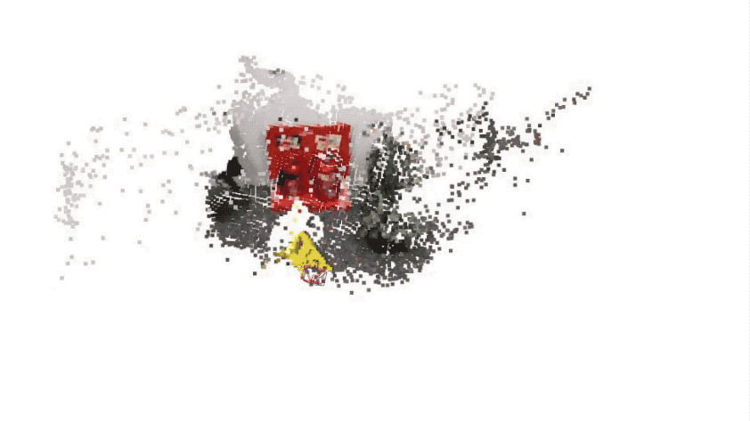
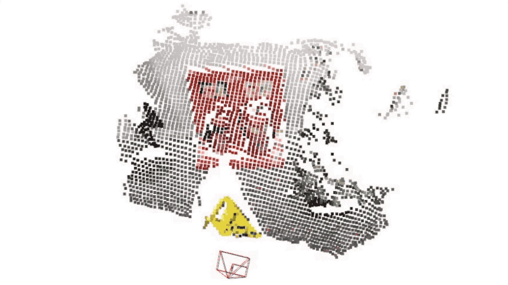
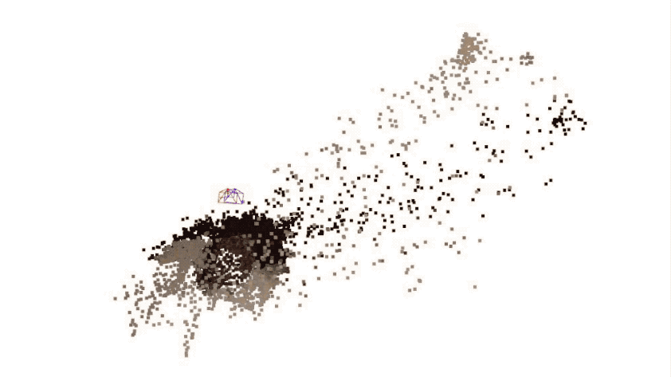
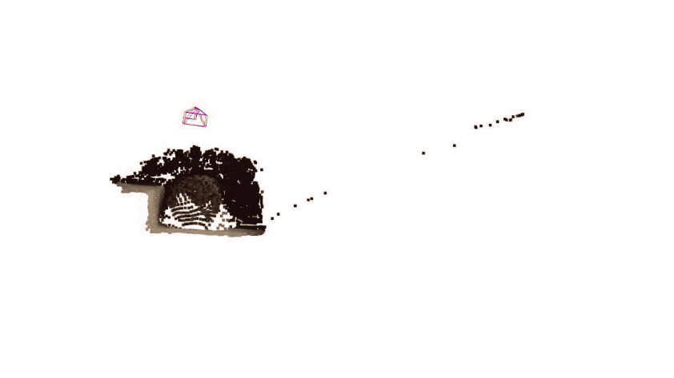

# KFNet
This is a Tensorflow implementation of "Learning Temporal Camera Relocalization using Kalman Filtering".


## About

### Network architecture

<p align="center">

</p>


### Sample results on [7scenes](https://www.microsoft.com/en-us/research/project/rgb-d-dataset-7-scenes/) and [12scenes](http://graphics.stanford.edu/projects/reloc/)

|| DSAC++ | KFNet |
|:--:|:--:|:--:|
|7scenes-fire       |        |       |
|12scenes-office2-5a|  | |
|Description | Blue - ground truth poses   | Red - estimatd poses |

## Usage

### File format

* **Input:** The input folder of a project should contain the files below.
	* `image_list.txt` comprising the sequential full image paths in lines, 
	* `label_list.txt` comprising the full label paths in lines corresponding to the images. The label files are generated by the `tofile()` function of numpy matrices. They have a channel number of 4, with 3 for scene coordinates and 1 for binary masks of pixels. The mask for one pixel is 1 if its label scene coordinates are valid and 0 otherwise. Their resolutions are 8 times lower than the images. For example, for the [7scenes dataset](https://www.microsoft.com/en-us/research/project/rgb-d-dataset-7-scenes/), the images have a resolution of 480x640, while the label maps have a resolution of 60x80,
	* `transform.txt` recording the 4x4 Euclidean transformation matrix which decorrelates the scene point cloud to give zero mean and correlations.

* **Output:** The testing program (to be introduced below) outputs a 3-d scene coordinate map (in meters) and a 1-d confidence map into a 4-channel numpy matrix for each input image. 
	* The confidences are the inverse of predicted Gaussain variances / uncertainties. Thus, the larger the confidences, the smaller the variances are. 
	* You can visualize a scene coordinate map as a point cloud via [Open3d](http://www.open3d.org/docs/release/getting_started.html) by running ```python vis_scene_coordinate_map.py <path_to_npy_file>```.
	* Or you can visualzie a streaming scene coordinate map list by running ```python vis_scene_coordinate_map_list.py <path_to_npy_list>```.


### Environment

The codes are tested along with 
* python 2.7,
* tensorflow-gpu 1.12.

### Testing

* Test SCoordNet
```
git checkout SCoordNet
python SCoordnet/eval.py --input_folder <input_folder> --output_folder <output_folder> --model_folder <model_folder> --scene <scene>
# <scene> = chess/fire/heads/office/pumpkin/redkitchen/stairs, i.e., one of the scene names of 7scenes dataset
```

* Test KFNet
```
git checkout master
python KFNet/eval.py --input_folder <input_folder> --output_folder <output_folder> --model_folder <model_folder> --scene <scene>
```

### Training

The training procedure has 3 stages. 

1. **Train SCoordNet** for each scene independently.
```
git checkout SCoordnet
python SCoordnet/train.py --input_folder <input_folder> --model_folder <scoordnet_model_folder> --scene <scene>
```

2. **Train OFlowNet** using general image sequences that are not limited to any specific scenes.
```
git checkout OFlowNet
python OFlowNet/train.py --input_folder <input_folder> --model_folder <oflownet_model_folder>
```

3. **Train KFNet** for each scene from the pre-trained SCoordNet and OFlowNet models to jointly finetune their parameters.
```
git checkout master
python KFNet/train.py --input_folder <input_folder> --model_folder <model_folder> --scoordnet <scoordnet_model_folder> --oflownet <oflownet_model_folder> --scene <scene>
```


## Credit

This implementation was developed by [Lei Zhou](https://zlthinker.github.io/). Feel free to contact Lei for any enquiry.