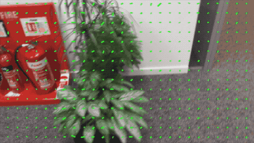
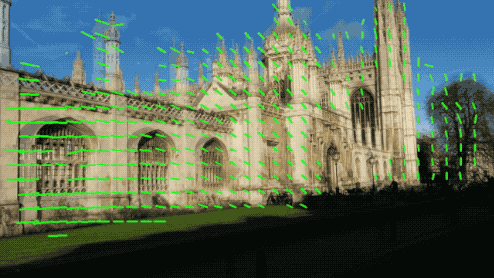

# KFNet
This is a Tensorflow implementation of our CVPR 2020 Oral paper - ["KFNet: Learning Temporal Camera Relocalization using Kalman Filtering"](https://arxiv.org/abs/2003.10629) by Lei Zhou, Zixin Luo, Tianwei Shen, Jiahui Zhang, Mingmin Zhen, Yao Yao, Tian Fang, Long Quan.

This paper addresses the temporal camera relocalization of time-series image data by folding the scene coordinate regression problem into the principled Kalman filter framework.


## About

### Network architecture

<p align="center">

</p>


### Sample results on [7scenes](https://www.microsoft.com/en-us/research/project/rgb-d-dataset-7-scenes/) and [12scenes](http://graphics.stanford.edu/projects/reloc/)

KFNet simultaneously predicts the mapping points and camera poses in a temporal fashion within the coordinate system defined by a known scene.

|| DSAC++ | KFNet |
|:--:|:--:|:--:|
|7scenes-fire       |        |       |
|12scenes-office2-5a|  | |
|Description | Blue - ground truth poses   | Red - estimatd poses |

### Intermediate optical flow results on [7scenes](https://www.microsoft.com/en-us/research/project/rgb-d-dataset-7-scenes/), [12scenes](http://graphics.stanford.edu/projects/reloc/), [Cambridge](http://mi.eng.cam.ac.uk/projects/relocalisation/) and [DeepLoc](http://deeploc.cs.uni-freiburg.de/)

As an essential component of KFNet, the process system of KFNet (i.e., OFlowNet) delineates pixel transitions across frames through optical flow reasoning **yet without recourse to grouptruth optical flow labelling**. We visualize the predicted optical flow fields below while suppressing the predictions with too large uncertainties.

|Dataset | Description | Optical flow |
|:--:|:--:|:--:|
|7scenes-fire | Indoor; hand-held; small shaky motions |  | 
|12scenes-office2-5a | Indoor; hand-held; larger movements |  |
|Cambridge-KingsCollege | Outdoor; hand-held; large random motions |  |
|DeepLoc | Outdoor; vehicle-mounted; forward motions |  |

**Remark** For DeepLoc, since OFlowNet is trained only on one scene included in DeepLoc, the flow predictions appear somewhat messy due to the lack of training data. Training with a larger amount and variety of data would improve the results. 


## Usage

### File format

* **Input:** The input folder of a project should contain the files below.
	* `image_list.txt` comprising the sequential full image paths in lines. Please go to the [7scenes](https://www.microsoft.com/en-us/research/project/rgb-d-dataset-7-scenes/) dataset to download the source images.
	* `label_list.txt` comprising the full label paths in lines corresponding to the images. The label files are generated by the `tofile()` function of numpy matrices. They have a channel number of 4, with 3 for scene coordinates and 1 for binary masks of pixels. The mask for one pixel is 1 if its label scene coordinates are valid and 0 otherwise. Their resolutions are 8 times lower than the images. For example, for the [7scenes](https://www.microsoft.com/en-us/research/project/rgb-d-dataset-7-scenes/) dataset, the images have a resolution of 480x640, while the label maps have a resolution of 60x80.
	* `transform.txt` recording the 4x4 Euclidean transformation matrix which decorrelates the scene point cloud to give zero mean and correlations.
	* You can download the prepared input label map files of 7scenes from the Google drive links below.

	|[chess(13G)](https://drive.google.com/open?id=15LCNv8cZkg1tINggssB--MWDGxE3LoYq) |[fire(9G)](https://drive.google.com/open?id=1EaVPg_-6gp_7PWvsiHk05QHU425t5dql) |[heads(4G)](https://drive.google.com/open?id=1aYJPdekYuofNcqdsLNdphzCVVX93zT1w) |[office(22G)](https://drive.google.com/open?id=16hMHwI8dnWEmt0HoevfQxNsnyO7ND6Nb) |[pumpkin(13G)](https://drive.google.com/open?id=1elobB_maZ5tW1v_K3Anl9BGGlnkCKI8e) |[redkitchen(27G)](https://drive.google.com/open?id=1j5UG23me1Z8Sz9PBCeTNeZsw3mSeUTtS) |[stairs(7G)](https://drive.google.com/open?id=1Hv9bOsf68xNyaOJqpnOKHKcv9YYXroLj) |
	|:-:|:-:|:-:|:-:|:-:|:-:|:-:|

* **Output:** The testing program (to be introduced below) outputs a 3-d scene coordinate map (in meters) and a 1-d confidence map into a 4-channel numpy matrix for each input image. 
	* The confidences are the inverse of predicted Gaussain variances / uncertainties. Thus, the larger the confidences, the smaller the variances are. 
	* You can visualize a scene coordinate map as a point cloud via [Open3d](http://www.open3d.org/docs/release/getting_started.html) by running ```python vis/vis_scene_coordinate_map.py <path_to_npy_file>```.
	* Or you can visualize a streaming scene coordinate map list by running ```python vis/vis_scene_coordinate_map_list.py <path_to_npy_list>```.


### Environment

The codes are tested along with 
* python 2.7,
* tensorflow-gpu 1.12.

Run ```sudo pip install -r requirements.txt``` to install tensorflow and other necessary python packages.

### Testing

* Download

You can download the trained models of [7scenes](https://www.microsoft.com/en-us/research/project/rgb-d-dataset-7-scenes/) from the [Google drive link (3G)](https://drive.google.com/open?id=13KZGz_akJw8iTQW90pgbuw2JAQzV7cG8).

* Test SCoordNet
```
git checkout SCoordNet
python SCoordnet/eval.py --input_folder <input_folder> --output_folder <output_folder> --model_folder <model_folder> --scene <scene>
# <scene> = chess/fire/heads/office/pumpkin/redkitchen/stairs, i.e., one of the scene names of 7scenes dataset
```

* Test OFlowNet
```
git checkout OFlowNet
python OFlowNet/eval --input_folder <input_folder> --output_folder <output_folder> --model_folder <model_folder>
```
The testing program of OFlowNet will save the 2-d optical flows and 1-d uncertainties of consecutive image pairs as npy files of the dimension 60x80x3. You can visualize the flow results by running scripts ```vis/vis_optical_flow.py``` and ```vis/vis_optical_flow_list.py```.

* Test KFNet
```
git checkout master
python KFNet/eval.py --input_folder <input_folder> --output_folder <output_folder> --model_folder <model_folder> --scene <scene>
```

### Training

The training procedure has 3 stages. 

1. **Train SCoordNet** for each scene independently.
```
git checkout SCoordnet
python SCoordNet/train.py --input_folder <input_folder> --model_folder <scoordnet_model_folder> --scene <scene>
```

2. **Train OFlowNet** using all the image sequences that are not limited to any specific scenes, for example, concatenating all the ```image_list.txt``` and ```label_list.txt``` of 7scenes for training.
```
git checkout OFlowNet
python OFlowNet/train.py --input_folder <input_folder> --model_folder <oflownet_model_folder>
```

3. **Train KFNet** for each scene from the pre-trained SCoordNet and OFlowNet models to jointly finetune their parameters.
```
git checkout master
python KFNet/train.py --input_folder <input_folder> --model_folder <model_folder> --scoordnet <scoordnet_model_folder> --oflownet <oflownet_model_folder> --scene <scene>
```


## Credit

This implementation was developed by [Lei Zhou](https://zlthinker.github.io/). Feel free to contact Lei for any enquiry.
